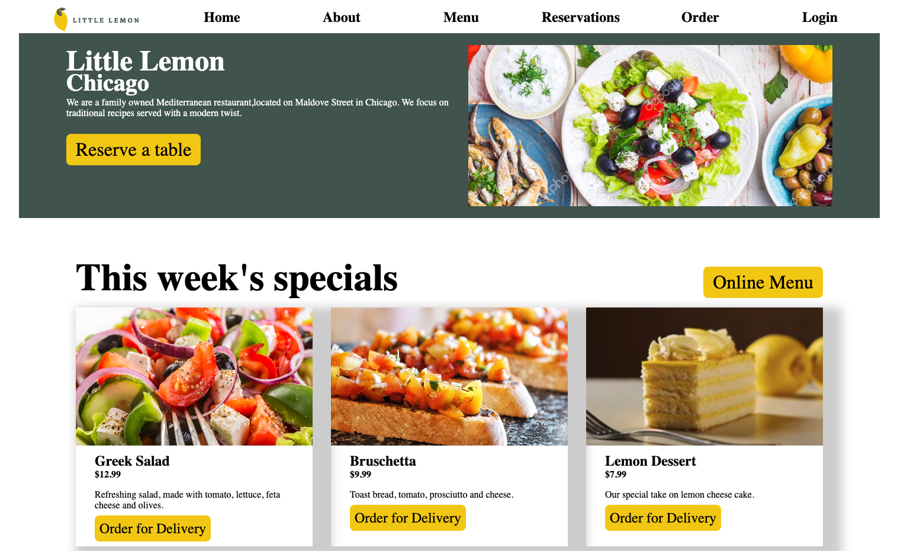
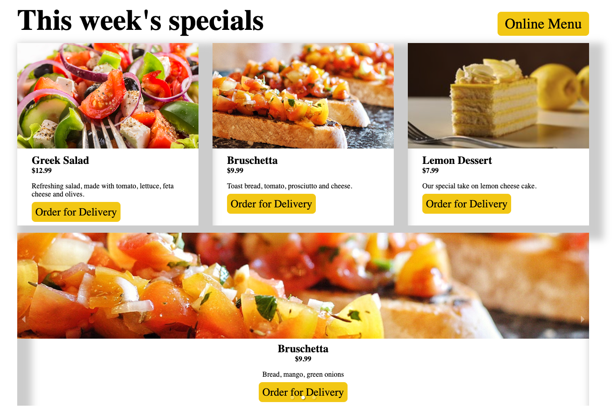
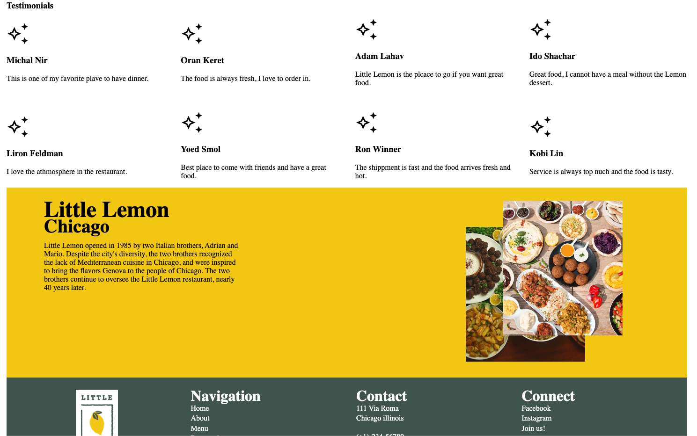

# Little Lemon Restaurant

Final capstone project for Meta Front-end developer program on Coursera, which contains a detailed and responsive website with table-booking functionality built using React.

## Screenshots 

### Tech Stack:

- HTML, CSS
- JSX
- React

### Third Party Libraries & APIs:

- react-router-dom
- react-responsive-carousel
- Meta front-end table-booking API

### Author
- [Etay Nir](https://github.com/Etay-Nir)